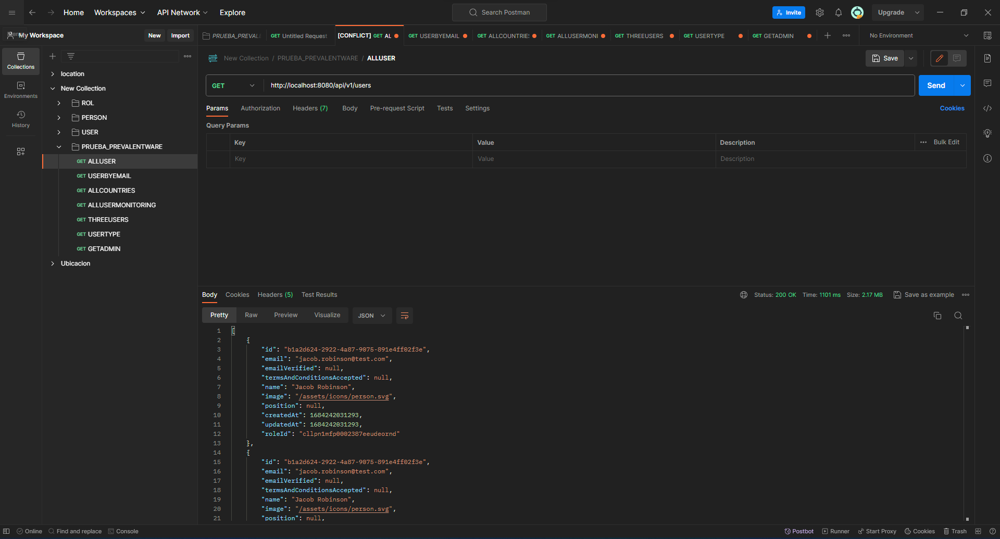
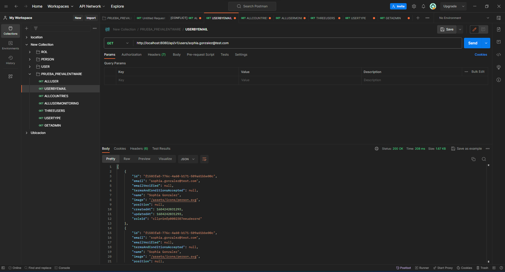
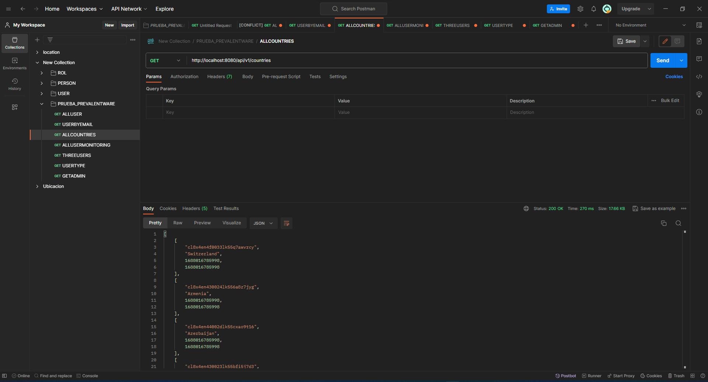
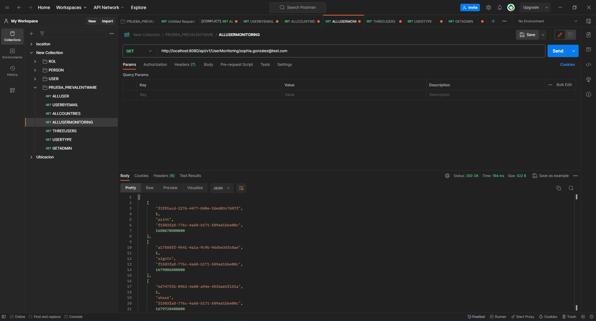
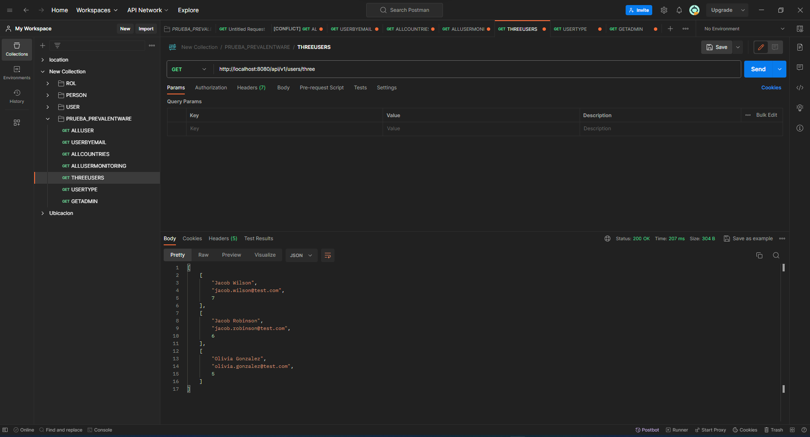
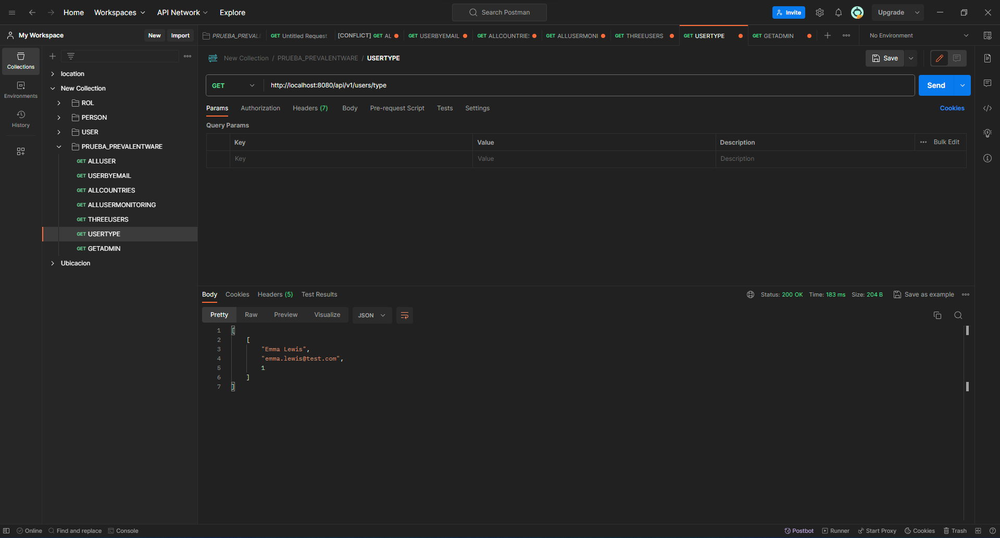
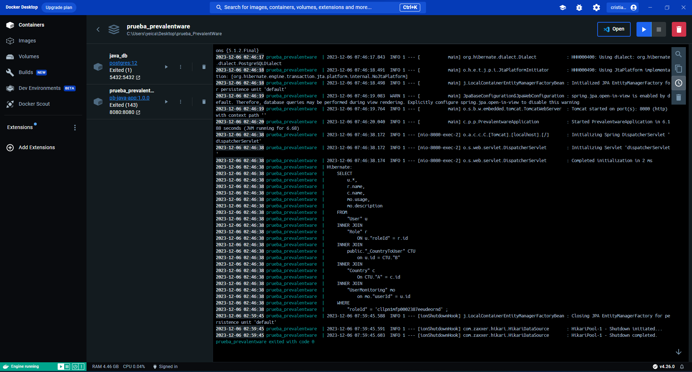

# prueba_PrevalentWare

**Explica tus decisiones y justificaciones**

-Inicialmente tenia un poco de confución a nivel de la prueba puesto que no la habia entendido pero por esta razon pedi una explicación de unos permisos al correo y ahi fue donde tome la decisión de comenzar a hacer las entidades las cuales iba a mapear para hacer el ORM.

-Despues de ya tener claro pase a conectarme a la base de datos para ver cada atributo y cada cosa que tenia cada tabla. Con esto empece a ponerle el tipo de dato en cada entidad con todo el nombre tal cual.

-Despues de tener todos los datos con su respectivo tipo de dato pase a crear el repositorio, el cual va a contener todas las consultas que he realizado en la prueba.

-Comence inicialmente haciendo las consultas en el Postgres y luego de hacer las consultas las iba revisando que funcionaras y trayera la data que pues fue lo que entendi de la información que se estaba requiriendo.

-Luego de que vi que sirvieran las consultas en Postgres pase a mandarlas con @Query native para que me capture todos los query como si estuviera utilizando el SQL de la base de datos.

-Despues de ya tener los Querys de todas las consultas realizadas pase a hacer el controlador para poder cada consulta retornarla en un try-catch, sabiendo que inicialmente estaba partiendo desde un servicio pero sabiendo que directamente puedo exponerlo entonces decidi por manejar un codigo mas limpio y menos robusto manejar retornando el repositorio en el controlador con cada metodo que voy a utilizar.

-El manejo del try-catch tiene la siguiente funcionabilidad, si logra entrar al try me retorna un 200 que es igual a un OK y me retorna el cuerpo u objeto que se esta pidiendo en cada consulta, si no entra al try y por lo contrario entra al catch tiene un mensaje como constante que me dice que la consulta no fue encontrada y me retorna un NOT_FOUND, sabiendo que este no funciona si y solo si mandamos la consulta mal.

-No habia recordado hablar de las propiedades que no fueron expuestas y cuentan con la URL, USERNAME, PASSWORD, esto es indispensable para poder hacer la conexión a la base de datos. Por otro lado se ha realizado una paginación por medio de Swagger que se ingresa con la siguiente url: http://localhost:8080/swagger-ui/index.html#/user-controller/getAllUserUsingGET, teniendo en cuenta que tiene una configuración la cual captura la ubicación de la carpeta controller para mapear cada endpoin del controlador, en este encontramos que podemos realizar pruebas ejecutando despues de presionar Try it out.

-Cada que iba exponiendo cada endpoint iba realizando pruebas en postman de lo que me iba dando en resultado que son los siguientes:

-Despues de mostrar lo anterior paso a hacer una compilación del proyecto para poder generar la carpeta target para poder empezar a hacer la parte del DockerFile y el docker-compose.

-Despues de ver que me funciona exitosamente y me genera el archivo.jar paso a crear los archivos de dockerfile y docker-compose, los cuales se crearon para poder exponer la imagen en docker y poder correr desde el docker, actualmente tambien probe el servicio en docker funcional que tiene el siguiente resultado:

-Despues de esto pase a hacer los test unitarios para el controlador teniendo el 100% de los metodos probados y el 100% de las lineas probadas.

-Tener en cuenta que todo esta con commit en el repositorio que entregare.

-Sin embargo proporsionare el postman en el proyecto

**Proporciona instrucciones para ejecutar tu solución.**

-Se debera tener en cuenta lo siguiente:

- Se debe tener las credenciales de base de datos en las propiedades que no he proporsionado por temas de seguridad.

- Se tener en cuenta los endpoint para los siguientes metodos:

    - http://localhost:8080/api/v1/users -> getAllUser.
    - http://localhost:8080/api/v1/users/{email} -> getUserByEmail.
    - http://localhost:8080/api/v1/countries -> getAllCountry.
    - http://localhost:8080/api/v1/UserMonitoring/{email} -> getAllUserMonitoring.
    - http://localhost:8080/api/v1/users/three -> getThreeUsers.
    - http://localhost:8080/api/v1/users/type -> getUserType.

- O si por lo contrario quiere probarlo en algo mas interactivo cuando arranca la aplicación ingresa a la URL de swagger.

**Ofrece el comando Docker para ejecutar el contenedor**

-Si no se tiene el target se tiene que hacer el siguiente comando  ./mvnw clean package, y si por el contrario ya se tiene se realizara un docker compose up.

**Describe tu propuesta de despliegue**

-Si hablamos de AWS con lambda podemos utilizar diferentes frameworks como Serverless para poder hacer mas facil el proceso, luego sigue poder empaquetar nuestra aplicación incluyendo todas las dependencias, se debe utilizar la consola de AWS lambda con esto se podra crear una nueva funcion lambda. Se debe configurar los eventos o bien conodidos triggers, se debe configurar las variables de entorno y parametros, probar las funciones lambda se debe ejecutar para poder saber si esta todo bien, configurar los permisos necesarios para acceder a otros servicios.

-Empaqueta tu aplicación en un contenedor Docker y crea un repositorio en Amazon ECR. Sube la imagen del contenedor al repositorio, Configura tu clúster ECS creando un clúster a través de la consola de AWS o la AWS CLI Define una Task, Definition que describa cómo ejecutar tu contenedor en ECS, Crea un servicio ECS que utilice tu definición de tarea y especifica el número de tareas que deseas ejecutar, (Opcional) Configura un balanceador de carga y asígnales tu servicio ECS para equilibrar la carga Configura variables de entorno para valores dinámicos, Verifica que tu aplicación esté funcionando correctamente en ECS.

**Quiero dejar en claro que me hicieron Falta algunas cosas pero tengo la capacidad y quiero seguir reforzando lo que me hace falta**
-